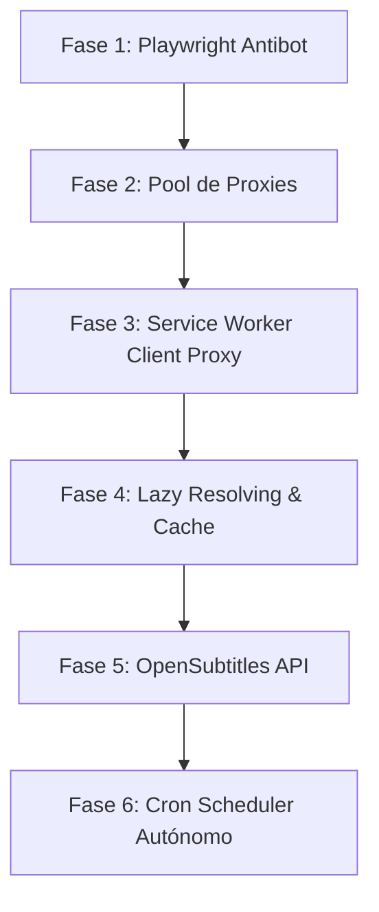

# Badrockplyr - Plan de Mejoras Tecnológicas y de Arquitectura

Este documento detalla el plan de implementación para las mejoras operativas, de robustez y de reproducción propuestas para el indexador y reproductor multi-fuente **Badrockplyr**. El objetivo es dotar a la plataforma de estabilidad en producción, evasión avanzada de bloqueos (anti-bots), mayor flexibilidad en la reproducción de fuentes protegidas y automatización en el mantenimiento de enlaces.

---

## 🎯 Objetivos Principales
1. **Evadir Bloqueos:** Implementar motores de navegación headless y proxies para sortear Cloudflare y rate limits.
2. **Estabilidad de Reproducción:** Resolver enlaces en tiempo real (Lazy Resolving) y permitir inyección de cabeceras HTTP en el cliente mediante Service Workers para evitar errores de reproducción (Forbidden 403).
3. **Automatización:** Ejecutar tareas en segundo plano de manera continua para actualizar enlaces caídos.
4. **Calidad del Servicio:** Incrementar la disponibilidad de subtítulos externos mediante integración con APIs dedicadas.

---

## 📅 Desglose de Fases de Implementación



---

## Fase 1: Optimización del Scraping y Evasión Antibot (Playwright)
* **Objetivo:** Utilizar navegadores headless reales para evadir retos JavaScript y muros antibot de Cloudflare en sitios como AnimeFLV y Cuevana3.
* **Componentes Afectados:**
  * [prisma/schema.prisma](file:///e:/Badrockplyr-copia-codex/prisma/schema.prisma) (verificar uso de la propiedad `usePlaywright` en `SourceSite`)
  * [src/services/authorizedScraper.ts](file:///e:/Badrockplyr-copia-codex/src/services/authorizedScraper.ts)
  * [src/app/actions/generatorActions.ts](file:///e:/Badrockplyr-copia-codex/src/app/actions/generatorActions.ts)
* **Detalles Técnicos:**
  1. Instalar y configurar `playwright-extra` y `puppeteer-extra-plugin-stealth` para evitar firmas de automatización en navegadores Chromium headless.
  2. Implementar un fallback en `authorizedScraper.ts` de modo que si `SourceSite.usePlaywright` es `true`, o si una petición HTTP directa retorna 403/503 con huellas de Cloudflare, se lance el navegador virtual para resolver el HTML de la página candidata.
  3. Extraer las cookies y el User-Agent generados durante la sesión del navegador virtual para adjuntarlos en las llamadas HTTP subsecuentes del mismo host.

---

## Fase 2: Pool Rotativo de Proxies en Backend
* **Objetivo:** Prevenir que la dirección IP de producción de la aplicación sea vetada o limitada por los proveedores de streaming e indexación.
* **Componentes Afectados:**
  * [src/lib/httpClient.ts](file:///e:/Badrockplyr-copia-codex/src/lib/httpClient.ts)
  * [src/lib/proxyConfig.ts](file:///e:/Badrockplyr-copia-codex/src/lib/proxyConfig.ts)
  * [src/lib/proxyHealth.ts](file:///e:/Badrockplyr-copia-codex/src/lib/proxyHealth.ts)
* **Detalles Técnicos:**
  1. Implementar un pool rotativo de proxies residenciales/backconnect en `httpClient.ts`.
  2. Mejorar `proxyHealth.ts` para evaluar la latencia y tasa de éxito (HTTP 200) de cada nodo de proxy contra endpoints de prueba clave (ej. TMDB API, servidores de streaming).
  3. Deshabilitar automáticamente los nodos de proxy que reporten timeouts constantes (>6s) o respuestas HTTP 429 (Too Many Requests).

---

## Fase 3: Proxy de Transmisión del Cliente (Service Workers)
* **Objetivo:** Inyectar cabeceras HTTP personalizadas (como `Referer` y `User-Agent`) en las peticiones del reproductor de video HTML5 sin necesidad de redirigir el tráfico multimedia de gran tamaño a través de los servidores de Badrockplyr.
* **Componentes Afectados:**
  * [src/app/play/embed/EmbedPlayer.tsx](file:///e:/Badrockplyr-copia-codex/src/app/play/embed/EmbedPlayer.tsx)
  * `public/sw-playback-proxy.js` (Nuevo Archivo - Service Worker)
* **Detalles Técnicos:**
  1. Registrar un Service Worker (`sw-playback-proxy.js`) al iniciar el reproductor en el frontend.
  2. Interceptar todas las solicitudes salientes de reproducción de video que coincidan con sub-recursos de video directos (ej. segmentos `.ts` o flujos `.mp4`).
  3. Modificar dinámicamente las cabeceras HTTP (`Referer` de origen, cookies, etc.) requeridas por el servidor de video (como StreamWish o Filemoon) para que el reproductor reproduzca directamente los streams oficiales sin arrojar HTTP 403 (Forbidden).

---

## Fase 4: Caché Inteligente de Tokens y Lazy Resolving (Resolución Tardía)
* **Objetivo:** Resolver los enlaces directos de video en el instante en que el usuario abre el reproductor, en lugar de hacerlo durante la indexación. Esto contrarresta los enlaces de streaming con tokens que caducan en pocas horas.
* **Componentes Afectados:**
  * [src/app/api/resolve-video/route.ts](file:///e:/Badrockplyr-copia-codex/src/app/api/resolve-video/route.ts)
  * [src/app/play/embed/EmbedPlayer.tsx](file:///e:/Badrockplyr-copia-codex/src/app/play/embed/EmbedPlayer.tsx)
  * [src/lib/streamResolveCache.ts](file:///e:/Badrockplyr-copia-codex/src/lib/streamResolveCache.ts)
* **Detalles Técnicos:**
  1. Modificar la base de datos para almacenar la URL base o el identificador del iframe original de reproducción.
  2. Cuando el reproductor sea cargado, solicitar dinámicamente a `/api/resolve-video` el enlace directo actualizado.
  3. Guardar el enlace directo desofuscado en Redis con una expiración (TTL) equivalente al 80% del tiempo de vida del token del host de video (ej. 2 horas para StreamWish). Si el reproductor vuelve a solicitar el recurso antes de expirar, se sirve de caché; si no, se vuelve a desofuscar.

---

## Fase 5: Integración con API de Subtítulos Externos (OpenSubtitles)
* **Objetivo:** Proveer subtítulos automáticos en múltiples idiomas cuando la página de origen no contenga tracks de subtítulos incrustados.
* **Componentes Afectados:**
  * [src/app/play/embed/EmbedPlayer.tsx](file:///e:/Badrockplyr-copia-codex/src/app/play/embed/EmbedPlayer.tsx)
  * [src/services/tmdbService.ts](file:///e:/Badrockplyr-copia-codex/src/services/tmdbService.ts)
  * `src/services/subtitleLookupService.ts` (Nuevo Servicio)
* **Detalles Técnicos:**
  1. Crear un servicio de búsqueda que consulte la API de OpenSubtitles REST (u otro proveedor open-source) utilizando el ID de TMDB (o nombre y año) de la película o episodio.
  2. Descargar los subtítulos coincidentes en formato `.vtt` (o convertirlos desde `.srt`), normalizarlos y almacenarlos localmente o en un bucket S3.
  3. Cargar dinámicamente los tracks adicionales en el elemento `<video>` de Plyr.

---

## Fase 6: Automatización del Planificador de Tareas (Cron Scheduler Autónomo)
* **Objetivo:** Revisar periódicamente la salud de los enlaces guardados en la biblioteca y lanzar procesos automáticos de scraping y corrección antes de que el usuario final acceda a ellos.
* **Componentes Afectados:**
  * `scripts/scheduler.ts` (Nuevo Script)
  * [src/lib/scrapeQueue.ts](file:///e:/Badrockplyr-copia-codex/src/lib/scrapeQueue.ts)
  * [scripts/scrape-worker.ts](file:///e:/Badrockplyr-copia-codex/scripts/scrape-worker.ts)
* **Detalles Técnicos:**
  1. Configurar un demonio autónomo (scheduler) usando BullMQ repeatable jobs o `node-cron` configurado para ejecutarse cada hora.
  2. El scheduler escaneará la base de datos en búsqueda de contenidos con estados `PENDING` o variantes cuyo último chequeo haya sido hace más de 12 horas.
  3. Por cada registro sospechoso o caído, el planificador encola una tarea de re-scrapeo en BullMQ para actualizar los streams a variantes activas y online.

---

## 📈 Plan de Migración a Producción (Prisma SQLite a PostgreSQL)
* **Objetivo:** Migrar la base de datos de desarrollo (SQLite `dev.db`) a PostgreSQL para soportar accesos concurrentes de los workers y peticiones de reproducción en servidores escalados.
* **Pasos:**
  1. Levantar el contenedor de Docker Compose provisto en [docker-compose.yml](file:///e:/Badrockplyr-copia-codex/docker-compose.yml) con PostgreSQL y Redis.
  2. Ajustar la variable `DATABASE_URL` en el archivo `.env` del servidor de producción.
  3. Ejecutar las migraciones de Prisma en la base de datos Postgres:
     ```bash
     npx prisma migrate deploy
     ```
  4. Ejecutar el script de migración de datos localizados en SQLite hacia Postgres usando el script provisto en la base:
     ```bash
     npm run db:migrate-data
     ```
