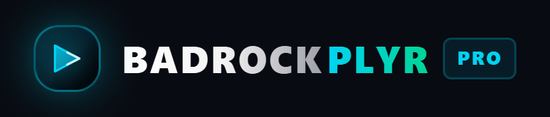
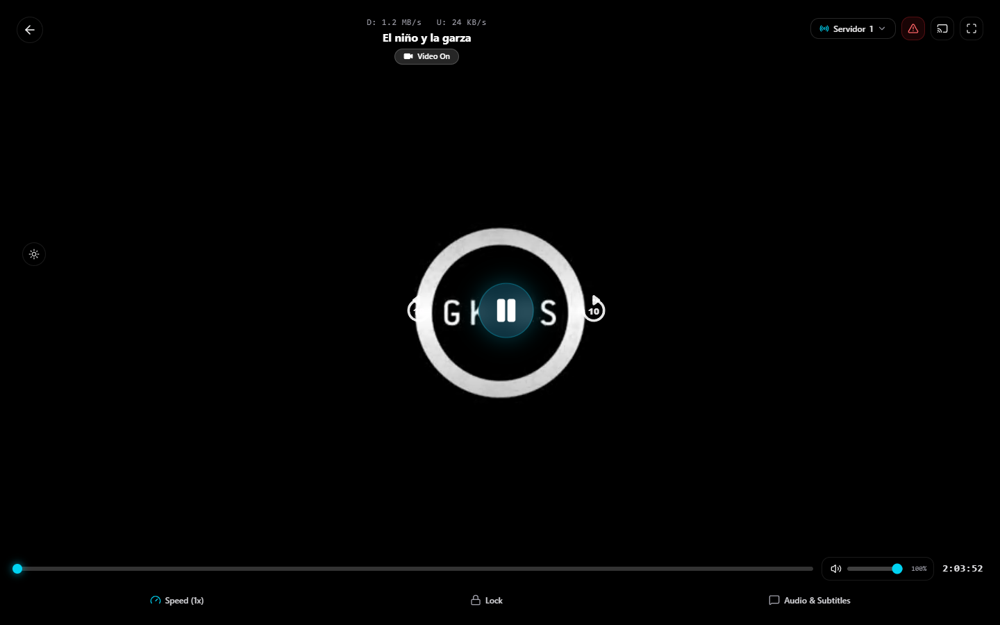
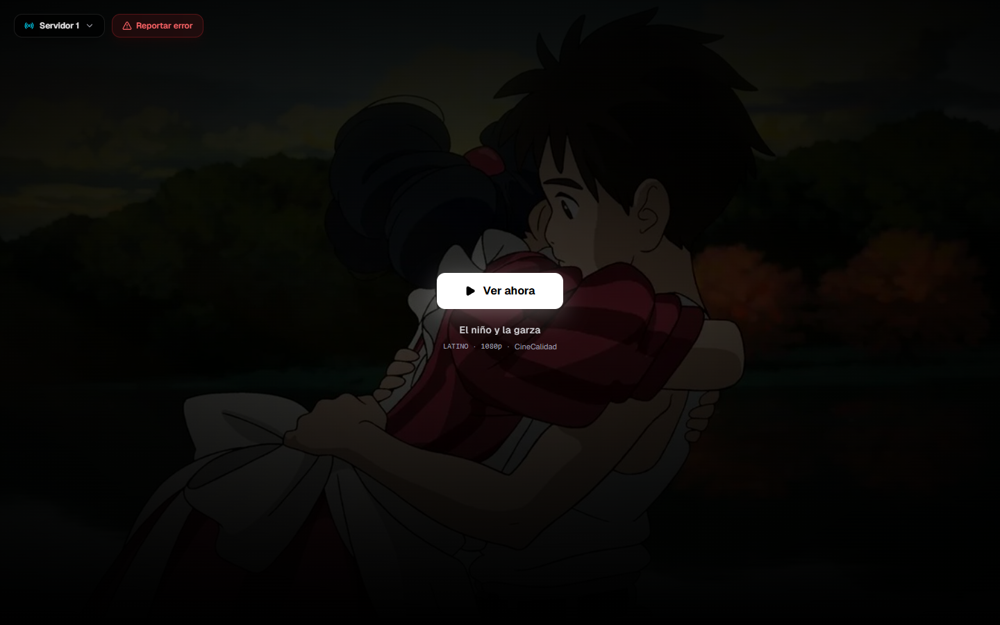
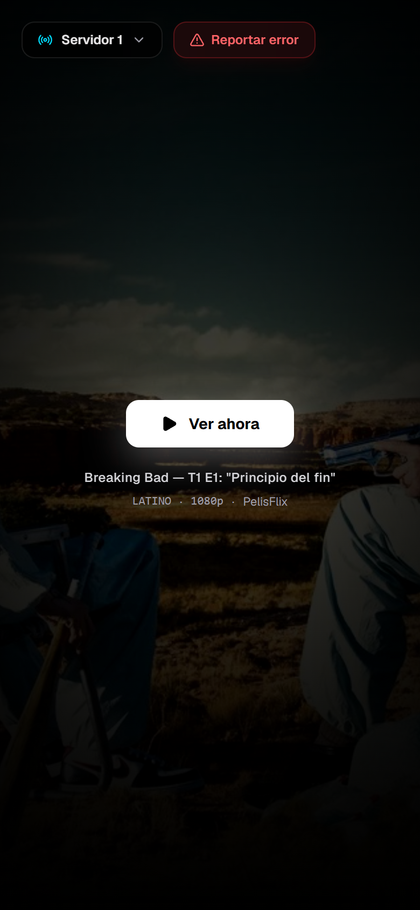
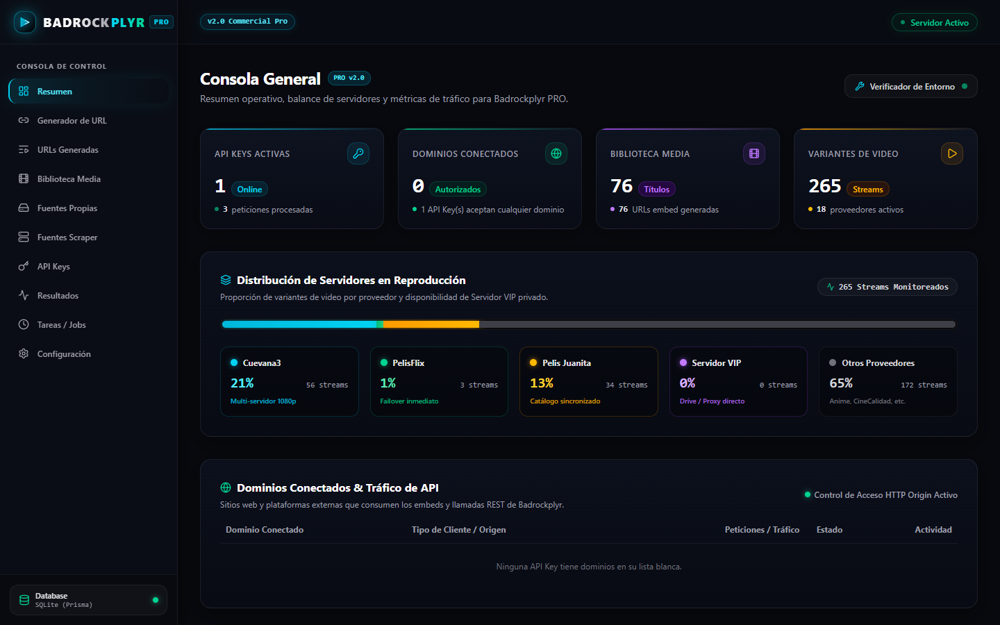
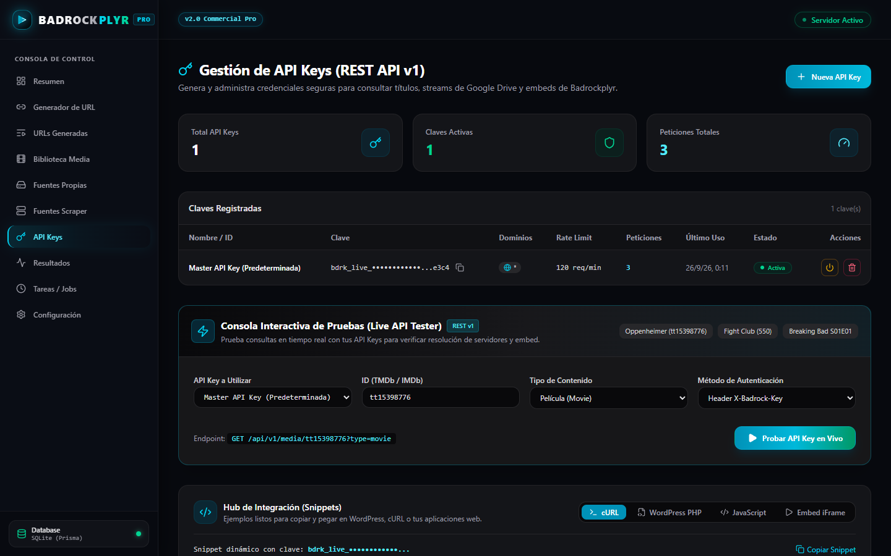
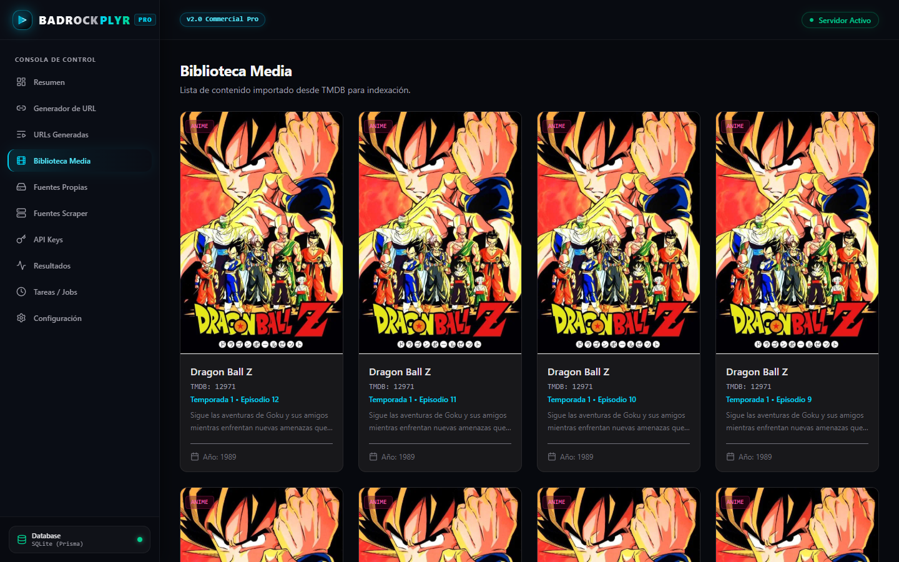
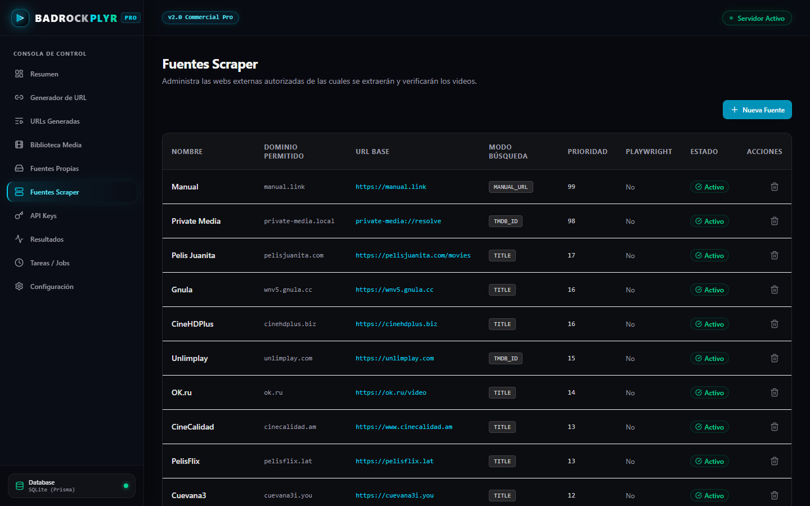
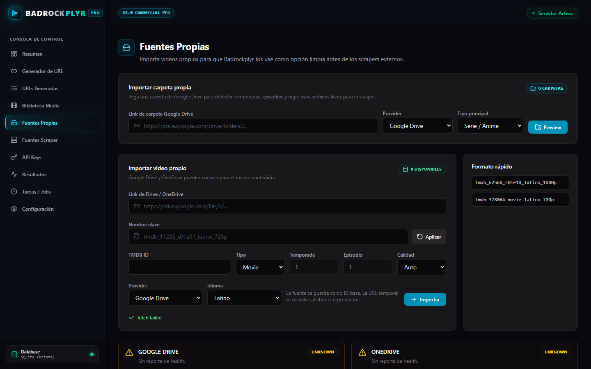
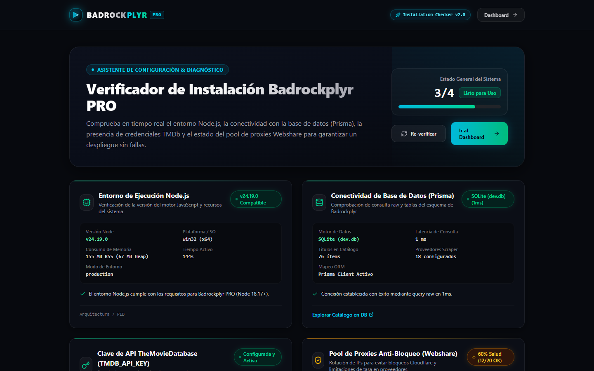

<p align="center">
  
</p>

<p align="center">
  Indexador multi-fuente, reproductor embebible y API REST para sitios de películas, series y anime.
</p>

<p align="center">
  
  
  
  
  
</p>

<p align="center">
  
</p>

## Contenido

- [Qué es](#qué-es)
- [Capturas](#capturas)
- [Funcionalidades](#funcionalidades)
- [Requisitos](#requisitos)
- [Instalación rápida](#instalación-rápida)
- [Variables de entorno](#variables-de-entorno)
- [Scripts](#scripts)
- [API REST v1](#api-rest-v1)
- [Integración con WordPress](#integración-con-wordpress)
- [Despliegue en producción](#despliegue-en-producción)
- [Estructura del proyecto](#estructura-del-proyecto)
- [Aviso legal](#aviso-legal)
- [Licencia](#licencia)

## Qué es

Badrockplyr recibe un ID de TMDb o IMDb, busca el título en varias fuentes configuradas, guarda las variantes de video que encuentra y las sirve de dos formas:

- **Un reproductor embebible** (`/play/embed/...`) con selector de servidor, controles propios y soporte HLS.
- **Una API REST autenticada** (`/api/v1/...`) para que WordPress u otras aplicaciones consulten los servidores disponibles.

Todo se administra desde un panel web en `/dashboard`.

## Capturas

Todas las capturas son del sistema funcionando en local.

**Reproductor**

| Escritorio | Móvil |
| :---: | :---: |
|  |  |

**Panel de administración**

| Consola general | Gestión de API Keys |
| :---: | :---: |
|  |  |

| Biblioteca | Fuentes scraper |
| :---: | :---: |
|  |  |

| Fuentes propias (Drive / OneDrive) | Verificador de instalación |
| :---: | :---: |
|  |  |

## Funcionalidades

**Indexación**
- Genera la ficha del título (sinopsis, póster, año) desde TMDb y acepta IDs de IMDb (`tt...`).
- Busca en las fuentes que actives en el panel, con prioridad configurable por fuente.
- Resuelve enlaces directos (`.mp4` / `.m3u8`) cuando el host lo permite.
- Cola de trabajos opcional con BullMQ + Redis y un worker aparte (`npm run worker:scrape`).
- Rotación de proxies salientes con chequeo de salud desde el panel.

**Reproductor**
- Selector de servidor, velocidad, bloqueo de pantalla, brillo, volumen y subtítulos.
- Adaptado a móvil y táctil.
- Las fuentes propias ("Servidor VIP") siempre se ordenan al final de la lista.

**Fuentes propias**
- Importa videos o carpetas completas de Google Drive y OneDrive mediante un servicio aparte (`services/private-media-resolver`).

**API y WordPress**
- API REST v1 con API Keys, límite de peticiones por minuto y lista blanca de dominios.
- Consola de pruebas de la API dentro del panel.
- Tema hijo de WordPress y presets para DooPlay y ToroFlix.

## Requisitos

- Node.js 20 o superior (la imagen Docker usa Node 22)
- npm 10 o superior
- Una API key gratuita de [TMDb](https://www.themoviedb.org/settings/api)
- Opcional: Redis (cola de trabajos) y PostgreSQL (producción)

## Instalación rápida

```bash
git clone https://github.com/Mianvarh/badrockplyr.git
cd badrockplyr
npm install

cp .env.example .env        # y completa TMDB_API_KEY

npx prisma generate
npx prisma db push          # crea dev.db (SQLite)

npm run dev
```

Luego abre:

- `http://localhost:3000/setup`: verifica Node, base de datos, clave de TMDb y proxies.
- `http://localhost:3000/dashboard`: panel de administración.

## Variables de entorno

Plantillas incluidas: [`.env.example`](.env.example) (desarrollo), [`.env.example.production`](.env.example.production) y [`.env.example.private-media`](.env.example.private-media).

| Variable | Obligatoria | Descripción |
| --- | :---: | --- |
| `DATABASE_URL` | Sí | `file:./dev.db` en local o una URL `postgresql://` en producción |
| `TMDB_API_KEY` | Sí | Clave de la API de TMDb |
| `NEXT_PUBLIC_APP_URL` | Sí | URL pública; se usa para armar los enlaces de embed |
| `REDIS_URL` | No | Conexión a Redis para la cola de trabajos |
| `SCRAPE_QUEUE_ENABLED` | No | `true` para procesar el scraping en el worker |
| `SCRAPE_WORKER_CONCURRENCY` | No | Trabajos simultáneos del worker |
| `OUTBOUND_PROXY_MODE` | No | Uso de proxies salientes (`optional`, etc.) |
| `OUTBOUND_PROXY_URLS` | No | Proxies separados por comas |
| `OUTBOUND_PROXY_ROTATION` | No | Estrategia de rotación (`round_robin`) |
| `WEBSHARE_POOL_1`, `WEBSHARE_POOL_2` | No | Grupos de proxies para el streaming de fuentes propias |
| `BADROCK_MASTER_KEY` | No | Clave aceptada siempre por la API REST |
| `PRIVATE_MEDIA_RESOLVER_URL` | No | URL del servicio de fuentes propias |
| `GOOGLE_DRIVE_API_KEY` | No | Para importar desde Google Drive |
| `MICROSOFT_GRAPH_CLIENT_ID` / `_CLIENT_SECRET` / `_TENANT_ID` | No | Para importar desde OneDrive |
| `PELISJUANITA_BASE_URL`, `PELISJUANITA_API_TOKEN` | No | Integración con el catálogo de Pelis Juanita |
| `DEBUG_LOGS` | No | `true` para logs detallados |

> [!IMPORTANT]
> No subas tu `.env` al repositorio. Ya está en `.gitignore`.

## Scripts

| Comando | Qué hace |
| --- | --- |
| `npm run dev` | Servidor de desarrollo |
| `npm run build` / `npm start` | Build y servidor de producción |
| `npm test` | Ejecuta los tests con Vitest |
| `npm run lint` | ESLint |
| `npm run db:generate` | Genera el cliente de Prisma |
| `npm run db:migrate` | Aplica las migraciones (PostgreSQL) |
| `npm run db:migrate-data` | Copia los datos de SQLite a PostgreSQL |
| `npm run worker:scrape` | Worker de la cola de scraping |
| `npm run loop:embeds` | Revisa en bucle que cada título tenga servidores suficientes |
| `npm run private-media:dev` | Servicio de fuentes propias (puerto 3091) |

## API REST v1

Crea una API Key en **Dashboard → API Keys** y envíala de cualquiera de estas formas:

```
X-Badrock-Key: <tu-api-key>
Authorization: Bearer <tu-api-key>
?api_key=<tu-api-key>
```

Sin clave, la API responde `401`. Con un dominio no autorizado responde `403`, y al superar el límite por minuto, `429`.

### `GET /api/v1/auth/verify`

Comprueba que la clave sea válida.

```bash
curl -H "X-Badrock-Key: $BADROCK_KEY" http://localhost:3000/api/v1/auth/verify
```

```json
{
  "success": true,
  "valid": true,
  "data": {
    "name": "Master API Key (Predeterminada)",
    "key": "bdrk_live_…a1b2",
    "active": true,
    "allowedDomains": "*",
    "rateLimitPerMinute": 120,
    "requestCount": 0,
    "lastUsedAt": null
  }
}
```

### `GET /api/v1/media/{id}`

Devuelve la ficha del título, el iframe del reproductor y los servidores disponibles. Si el título aún no está indexado, lo busca en ese momento. La respuesta de ejemplo está abreviada. Si el título tiene fuentes propias, aparecen al final como `"Servidor VIP (Fuente Propia)"` con `"isVip": true`.

| Parámetro | Valor |
| --- | --- |
| `id` | TMDb ID (`508883`) o IMDb ID (`tt6587046`) |
| `type` | `movie` (por defecto), `tv` o `anime` |
| `season`, `episode` | Solo para series y anime (por defecto `1`) |

```bash
curl -H "X-Badrock-Key: $BADROCK_KEY" \
  "http://localhost:3000/api/v1/media/508883?type=movie"
```

```json
{
  "success": true,
  "data": {
    "tmdbId": "508883",
    "imdbId": "tt6587046",
    "title": "El niño y la garza",
    "year": 2023,
    "type": "movie",
    "overview": "…",
    "posterUrl": "https://image.tmdb.org/t/p/w500/…",
    "backdropUrl": "https://image.tmdb.org/t/p/original/…",
    "embedPlayerUrl": "http://localhost:3000/play/embed/movie/508883",
    "embedIframe": "<iframe src=\"…\" …></iframe>",
    "servers": [
      { "id": 1, "name": "Servidor 1", "source": "CineCalidad", "language": "LATINO", "quality": "1080p", "url": "…" },
      { "id": 2, "name": "Servidor 2", "source": "Cuevana3", "language": "LATINO", "quality": "HD", "url": "…" }
    ]
  }
}
```

### Embed directo

Sin API, puedes insertar el reproductor con un iframe:

```html
<!-- Película -->
<iframe src="https://tu-dominio.com/play/embed/movie/508883" allowfullscreen></iframe>

<!-- Episodio: /play/embed/tv/{tmdbId}/{temporada}/{episodio} -->
<iframe src="https://tu-dominio.com/play/embed/tv/1396/1/1" allowfullscreen></iframe>
```

## Integración con WordPress

Paquetes incluidos en `dist/`:

- `badrock-child-theme.zip`: tema hijo con importador por IMDb/TMDb y reproductor.
- `badrock-wordpress-presets.zip`: integraciones para DooPlay y ToroFlix.

1. En WordPress ve a **Apariencia → Temas → Añadir nuevo → Subir tema**, sube `badrock-child-theme.zip` y actívalo.
2. Abre **Badrock Player → Badrock API Settings**, escribe la URL de tu servidor Badrockplyr y tu API Key, y pulsa **Probar Conexión con Badrock**.
3. En el editor de una entrada aparecerá la caja **Badrock Auto-Importador**: escribe un ID de IMDb o TMDb y pulsa **Importar con Badrock**.

Para regenerar los zip después de modificar el tema: `npx tsx scripts/build-wordpress-theme.ts`.

## Despliegue en producción

El repositorio incluye `Dockerfile`, `docker-compose.yml` (app, worker, PostgreSQL, Redis y Caddy con HTTPS automático) y `Caddyfile`.

```bash
cp .env.example.production .env.production   # completa dominio, contraseñas y claves
docker compose --env-file .env.production up -d --build postgres redis
docker compose --env-file .env.production run --rm app npm run db:migrate
docker compose --env-file .env.production up -d --build
```

`POSTGRES_PASSWORD` es obligatoria: `docker compose` se detiene si no está definida.

Guía completa paso a paso para VPS: [`docs/deployment/vps.md`](docs/deployment/vps.md). Servicio de fuentes propias: [`docs/private-media-resolver.md`](docs/private-media-resolver.md).

## Estructura del proyecto

```
src/
  app/
    api/v1/            API REST (auth/verify, media/[id])
    api/stream/        Proxy de streaming para fuentes propias
    dashboard/         Panel de administración
    play/embed/        Reproductor embebible
    setup/             Verificador de instalación
  lib/                 Autenticación de API Keys, Prisma, proxies, políticas de reproducción
  services/            Scrapers, cliente de TMDb, proxies
services/
  private-media-resolver/   Servicio de Google Drive / OneDrive
prisma/                Esquema y migraciones
scripts/               Worker, migración de datos, empaquetado del tema de WordPress
tests/                 Tests de Vitest
wordpress/             Tema hijo y presets (código fuente de los zip de dist/)
```

## Aviso legal

Badrockplyr es una herramienta de indexación y reproducción. No aloja ni distribuye contenido. Quien la instala es responsable de configurar solo fuentes que tenga derecho a usar y de cumplir las leyes de derechos de autor de su país.

## Licencia

Software propietario. Todos los derechos reservados.

Desarrollado por [@Mianvarh](https://github.com/Mianvarh).
